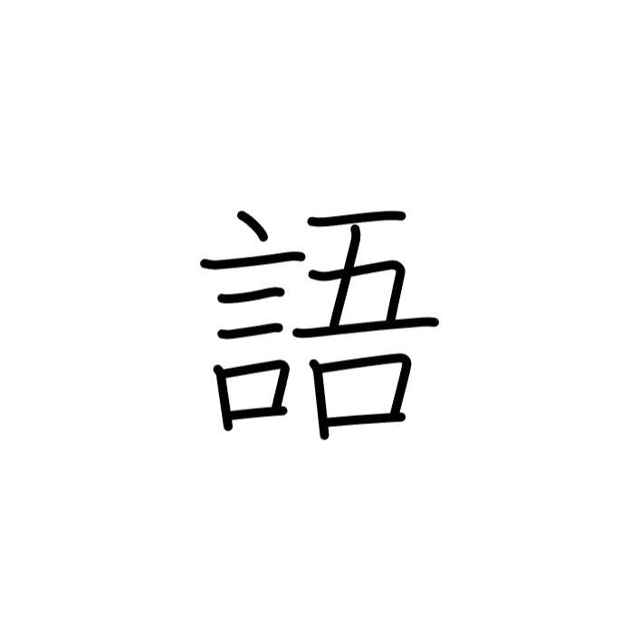

# Kanji-Morph


I'm currently studying kanji in my pursuit of Japanese language proficiency. A _lot_ of kanji.  

So, I wanted to do a little generative art project involving kanji.
I took the excellent SVG data from the [KanjiVG](http://kanjivg.tagaini.net/) project and created an algorithm to morph between kanji by moving all the individual strokes.  


Big shoutout to the Javascript vector graphics scripting tool [Paper.JS](http://paperjs.org/); it was a great fit for this project.

## Setup

You'll need to download the KanjiVG data.  
`setup.js` is a node script that should do this for you if you have node installed. This command installs the necessary npm libraries and runs it.
```
npm install fs request unzipper && node setup.js
```
Otherwise you can manually download KanjiVG from their [releases page](https://github.com/KanjiVG/kanjivg/releases) and unzip it into the top level of the repo (`/kanji`). Here's the release I used during development: [link](https://github.com/KanjiVG/kanjivg/releases/download/r20230110/kanjivg-20230110-all.zip).

## Running
Just opening index.html won't work because of CORS, so to run the project you'll need to serve `index.html` locally somehow.
I used:
```
python3 -m http.server
```

---
**Attribution**  
KanjiVG is copyright © 2009-2023 Ulrich Apel and released under the [Creative Commons Attribution-Share Alike 3.0](http://creativecommons.org/licenses/by-sa/3.0/) license.

Paper.js distributed under the permissive [MIT license](http://paperjs.org/license/).